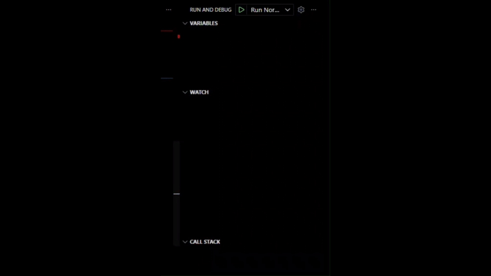

# C/C++ Kit

A complete C/C++ development kit with everything you need to get started with C/C++ programming, including graphics support and pre-configured VS Code tasks.
<br><br>
<p align="center">

  <!-- License -->
  <a href="https://www.apache.org/licenses/LICENSE-2.0" title="Apache 2.0 License">
    
  </a>

  <!-- Version -->
  <a href="https://github.com/kalyugwasi/Cpp-Kit/releases/latest" title="Latest Version">
    
  </a>

  <!-- Downloads -->
  <a href="https://github.com/kalyugwasi/Cpp-Kit/releases" title="Total Downloads">
    
  </a>

  <!-- Visitors -->
  

  <br><br>

  <!-- DOWNLOAD BUTTON WITH GLOW EFFECT -->
  <a href="https://github.com/kalyugwasi/Cpp-Kit/releases/latest" title="Download Now">
    
  </a>

</p>


## 📍 Installation Paths

```
Compiler:           C:\mingw64
Examples:           %USERPROFILE%\Documents\Kalyug C++ Student Kit\Examples
VSCode Templates:   {app}\vscode-templates
```

> **Important:** After installation, open a new terminal or restart your PC to update PATH environment variables.

<br><br>
## 🚀 Quick Start with VS Code

### First-Time Setup (For Graphics)

1. Download Latest release from top of the page (or [click here](https://github.com/kalyugwasi/Cpp-Kit/releases/latest))


2. Install the `.exe` File
3. Open **VS Code**
4. Go to **File → Open Folder**
5. Select:
   - 📂 `Documents`
   - 📂 `Kalyug C++ Student Kit`
6. Click **Select Folder**
7. If prompted, click:  
   → **Yes, I trust the authors**
8. Open: `Examples/circle.cpp`
9. Install: **C/C++ Extensions Pack**  
   *(VS Code will suggest automatically, or use this [link](https://marketplace.visualstudio.com/items?itemName=ms-vscode.cpptools-extension-pack)*  
10. Press **Ctrl + Shift + D** → Select **Run Graphics C++**



11. Press **Ctrl + Shift + B** → Built
12. Press **F5** (or **Fn + F5**) → Run

🎉 You’re ready to build graphics programs!

<br><br>
## 🛠️ Building Your Code

### Using VS Code Tasks

| Task | Shortcut |
|------|----------|
| Show all build tasks | `Ctrl + Shift + B` |
| Show debug configuration | `Ctrl + Shift + D` |

**Available Tasks**
- **Build Normal C++** → Standard console apps
- **Build Graphics C++** → Programs using `graphics.h`

**Output Location:** `.bin\your_program.exe`

<br><br>
## ✨ Features

- ✅ MinGW-w64 C++ Compiler (64-bit)
- ✅ `graphics.h` + `winbgim.h` (WinBGIm library)
- ✅ `libbgi.a` Graphics Link Library
- ✅ Example Programs (Stars.cpp + Circle.cpp + rectangle.cpp)
- ✅ Pre-configured Build tasks for VS Code

<br><br>
## 📦 What's Included

| Component | Description |
|-----------|-------------|
| **Compiler** | MinGW-w64 GCC 15.2.0 (64-bit) |
| **Graphics Library** | WinBGIm for easy graphics programming |
| **Examples** | Sample C++ programs with graphics |
| **VS Code Setup** | Ready-to-use build tasks |


<br><br>
### Command Line

#### Standard C++ Program
```bash
g++ file.cpp -o a.exe
```

#### Graphics Program
```bash
g++ file.cpp -o a.exe -lbgi -lgdi32 -lcomdlg32 -luuid -loleaut32 -lole32
```
<br><br>
## 📚 Example Programs

| Program | Type | Description |
|---------|------|-------------|
| `stars.cpp` | Basic | First basic program |
| `circle.cpp` | Graphics | Draws a circle using graphics.h |
| `rectangle.cpp` | Graphics | Draws a rectangle using graphics.h |

<br><br>
## 🐛 Troubleshooting

### Error: 'initgraph' or 'circle' undefined

**Cause:** Missing graphics library link flags

**Solution:** Use the "Build Graphics C++" task instead of the normal build task

### Error: g++ command not recognized

**Cause:** PATH environment variable not updated

**Solution:** 
- Restart your PC, OR
- Open a fresh terminal window (close and reopen your terminal)

### Graphics not displaying

**Cause:** Graphics.h requires specific Windows libraries

**Solution:** Ensure you're using the "Build Graphics C++" task which includes all necessary library links
<br><br>
## 🤝 Contributing

This project is free to share and improve. We welcome:
- Bug reports
- Feature suggestions
- Code improvements
- Documentation enhancements
- Sponsorship
<br><br>
## 🎯 Getting Help

If you encounter issues:

1. Check the **Troubleshooting** section above
2. Contact me at <kumarhimanshu2609@gmail.com>
3. Review the example programs
4. Verify your installation paths
5. Ensure all PATH variables are properly set

#
**Happy Coding!** 😎🔥

Made with ❤️ by Himanshu
